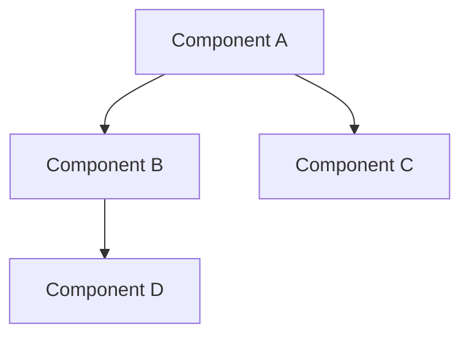
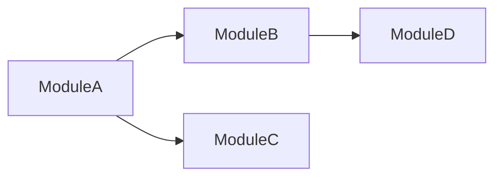
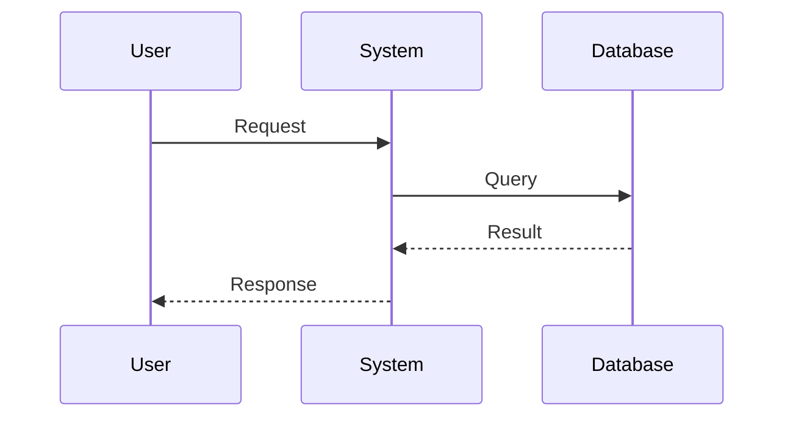
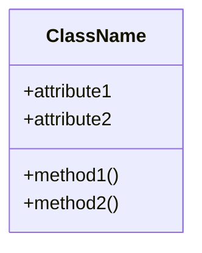

# コード読解ガイドライン

このドキュメントは、コード読解エージェントがコードを分析し、ドキュメントを生成する際の指針と品質基準を定義します。

## コード読解の基本原則

### 1. トップダウンアプローチ
- 全体構造から詳細へ: プロジェクト構造 → モジュール → 関数
- 実行フローを追跡: エントリーポイント → 主要機能 → ヘルパー関数
- データフローを理解: 入力 → 変換 → 出力

### 2. 体系的な分析
- **構造**: アーキテクチャパターン、レイヤー構造
- **依存関係**: モジュール間、ライブラリ依存
- **データフロー**: データの流れ、変換処理
- **アルゴリズム**: 最適化手法、計算量
- **公開インターフェース**: API、エントリーポイント

### 3. 文脈重視
- 関数単体ではなく、全体の中での役割を理解
- 呼び出し関係から責務を把握
- テストコードから期待動作を理解

## 分析観点

### アーキテクチャ分析
- レイヤー構造（プレゼンテーション、ビジネスロジック、データアクセス）
- デザインパターン（Singleton, Factory, Observer等）
- モジュール分割の原則
- 疎結合性、高凝集性

### データフロー分析
- 入力元: ファイル、ネットワーク、ユーザー入力
- 処理: 変換、検証、計算
- 出力先: ファイル、ネットワーク、画面表示
- エラーハンドリング: 例外処理、エラーコード

### パフォーマンス分析
- 時間計算量: O記法での評価
- 空間計算量: メモリ使用量
- 最適化手法: キャッシング、並列化、アルゴリズム選択
- ボトルネック: 遅い処理、重い計算

### 品質分析
- コードの可読性: 命名、構造、コメント
- テストカバレッジ: テストの有無と範囲
- エラーハンドリング: 堅牢性
- セキュリティ: 脆弱性の有無

## ドキュメント品質基準

### 完全性
- 主要コンポーネントを全て網羅
- データフローの全経路を記述
- 公開APIを全て記載
- 重要な内部関数も含める

### 正確性
- 技術的記述が正確
- 関数シグネチャが実コードと一致
- データフローが実装と一致
- 計算量の評価が正しい

### 明確性
- 専門用語に説明を付加
- 図表で視覚化
- 具体例を含める
- 段階的に詳細化

### 一貫性
- 用語の統一
- フォーマットの統一
- 詳細度のバランス
- スタイルの統一

## ドキュメントフォーマット標準

### 構造化ドキュメント

#### overview.md
- プロジェクトの目的
- 主要機能
- ディレクトリ構造
- 技術スタック
- エントリーポイント

#### architecture.md
- 全体構造図（Mermaid）
- 主要コンポーネント（責務、場所、API、依存関係）
- アーキテクチャパターン
- モジュール依存関係図

#### data-flow.md
- 主要データフローのシーケンス図
- データ変換の説明
- データ構造の定義
- エラーハンドリング

#### modules/<module>.md
- モジュール概要
- ファイル構成
- 主要機能
- 公開API
- 内部実装の特徴
- 依存関係

### 関数詳細ドキュメント

#### functions/<module>-functions.md
各関数について以下を記述：

1. **シグネチャ**: 完全な関数定義
2. **概要**: 1〜2文の簡潔な説明
3. **入力**: 引数の型、役割、制約
4. **出力**: 戻り値の型、意味、副作用
5. **処理内容**: ステップバイステップの詳細説明
6. **データ構造・変数**: 主要な変数の役割と使われ方
7. **アルゴリズム工夫点**:
   - 高速化: パフォーマンス最適化、時間計算量
   - メモリ効率化: メモリ削減手法、空間計算量
   - エッジケース対応: 境界値、エラー処理
8. **呼び出し関係**: 呼び出し元と呼び出し先
9. **全体の流れ**: 簡潔な結論（2〜3文）

## Mermaid図の活用

### コンポーネント図

### 依存関係図

### シーケンス図

### クラス図

## コード調査テクニック

### 効果的な検索
- 関数定義: `def function_name`, `function function_name`, `public void functionName`
- 関数呼び出し: 関数名で検索
- 型定義: `class`, `struct`, `type`, `interface`
- インポート/依存: `import`, `require`, `#include`

### 依存関係の把握
- インポート文から依存モジュールを特定
- 呼び出し関係から責務を理解
- テストファイルから使用例を確認

### パターン認識
- 繰り返し出現するコード構造
- 命名規則の一貫性
- アーキテクチャパターンの適用箇所

## レビュー基準

### 構造化ドキュメント
- [ ] プロジェクト全体像が理解できる
- [ ] 主要コンポーネントが全て説明されている
- [ ] アーキテクチャ図が含まれている
- [ ] データフローが明確
- [ ] モジュール間の関係が理解できる

### 関数詳細ドキュメント
- [ ] 全ての公開関数がドキュメント化されている
- [ ] 重要な内部関数も含まれている
- [ ] 入力/出力が明確
- [ ] 処理内容がステップバイステップで説明されている
- [ ] アルゴリズムの工夫点が記述されている
- [ ] 統一されたフォーマット

### 品質チェック
- [ ] 技術的な誤りがない
- [ ] 専門用語が説明されている
- [ ] 図表が効果的に使われている
- [ ] 用語が統一されている
- [ ] 読者が理解しやすい

## ベストプラクティス

### 調査時
- 最初にREADME、ドキュメントを確認
- ディレクトリ構造から全体像を把握
- エントリーポイントから実行フローを追跡
- テストコードから期待動作を理解
- 複雑な調査はサブエージェントに委譲

### ドキュメント作成時
- 読者の視点で記述（コードを読まなくても理解できる）
- 具体例を含める
- 図表で視覚化
- 重要な点を強調
- 簡潔だが十分な説明

### レビュー時
- 客観的な基準で評価
- 重大な問題を優先
- 建設的なフィードバック
- 完璧を求めすぎない（実用性重視）
